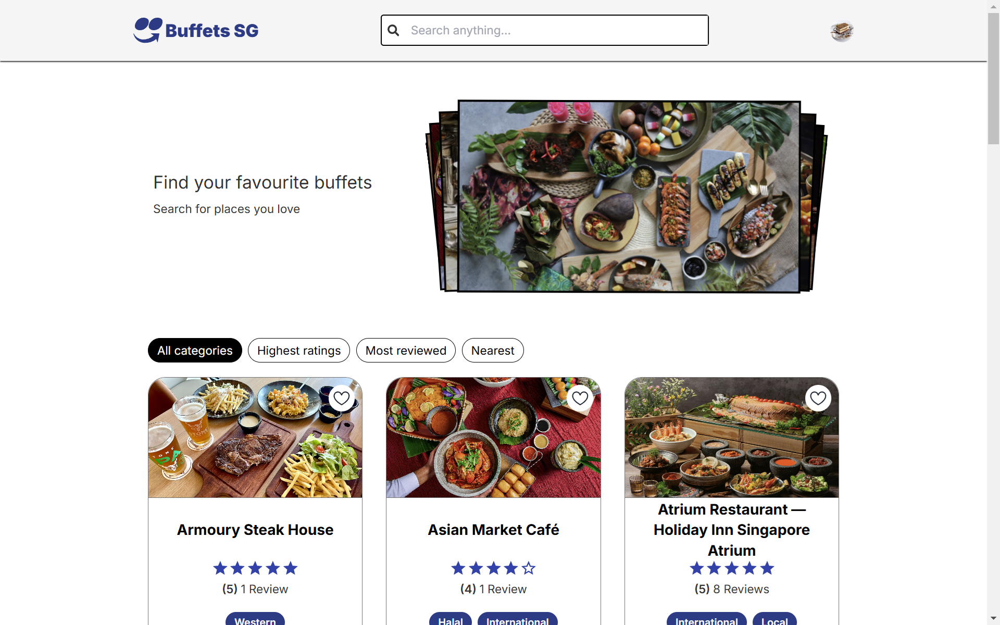
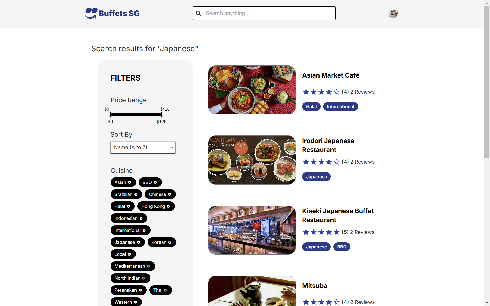

# Buffets SG



## Background Info

**Buffets SG** is a platform designed to help users search for buffets in Singapore conveniently. The application provides essential information, such as restaurant opening hours, location, price ranges, cuisines, and user reviews, enabling users to make informed dining choices.

## Screenshots

### Details Page


Displays detailed information about a selected restaurant, including its name, location, description, price range, opening hours, and user reviews.

### Search Page


User can search for restaurants and apply filters based on their preferences, such as location, price, cuisine, and ratings.

### Review Page


User can leave reviews and ratings for the restaurant to help others make their decisons on visiting the restaurant.

### Profile Page


Users can update or delete their reviews, view a list of their favourite restaurants and change account settings.

## Features

- **Landing Page**: View top-rated, most reviewed and nearest restaurants, giving users an overview of the best buffet options.
- **Search and Filters**: Locate restaurants quickly using search and refine results by price range, cuisine and various sorting options for a personalized experience.
- **Restaurant Details**: View detailed information about each restaurant, including descriptions, price ranges, locations, opening hours, and user reviews.
- **User Reviews**: Share experiences with ratings and reviews to help the community discover the best places.
- **Profile Management**: Update or delete reviews, view a list of favourite restaurants, and manage account settings.
- **Favourites**: Save restaurants to a personal list for easy future access.
- **Responsive Design**: Enjoy a seamless experience across all devices, from smartphones to desktops.

## Technologies Used

### Frontend

- **React**: Front-end JavaScript library for building user interfaces.
- **Vite**: Development environment and bundler.
- **React Router**: Declarative routing for React applications.
- **TanStack Query**: For efficient data fetching, caching and state management.
- **Axios**: Promise-based HTTP client for API requests.
- **Tailwind CSS**: Utility-first CSS framework for styling.

### Backend

- **Node.js**: JavaScript runtime environment for server-side development.
- **Express.js**: Web application framework for Node.js.
- **MongoDB**: NoSQL database for data storage.
- **Mongoose**: ODM library for MongoDB.
- **jsonwebtoken** - Library for creating and verifying JSON Web Tokens (JWTs) for authentication.

## Wireframe & Planning Materials


The Review Schema references to the User and Restaurant Model. User can favourite the restaurant and it's Id will be saved into favouites in the User model.

User Stories and Stretch Goals : [Trello board](https://trello.com/b/vJzdzWNm/buffets-sg)

## Getting Started

To get started with the project, follow these steps:

### Prerequisites

1. Ensure [Node.js](https://nodejs.org/en) and [MongoDB](https://www.mongodb.com/try/download/community) is installed.

### To Run Locally

#### Frontend (buffets-sg)

1. Open terminal and clone the repository:

   ```bash
   git clone https://github.com/guanjunming/buffets-sg.git
   ```

2. Navigate to the project directory:

   ```bash
   cd buffets-sg
   ```

3. Install the client dependencies:

   ```bash
   npm i
   ```

4. Create a `.env` file in the project directory and add the following variable:

   ```
   VITE_SERVER_URL=http://localhost:5001
   ```

#### Backend (buffets-server)

1. In another directory, open terminal and clone the repository:

   ```bash
   git clone https://github.com/guanjunming/buffets-server.git
   ```

2. Navigate to the project directory:

   ```bash
   cd buffets-server
   ```

3. Install the server dependencies:

   ```bash
   npm i
   ```

4. Create a `.env` file in the project directory and add the following variables:

   ```
   PORT=5001
   MONGODB_URI=mongodb://127.0.0.1:27017/buffets
   ACCESS_SECRET=<secret-key>    # Replace with a secret generated from a random key generator
   REFRESH_SECRET=<secret-key>   # Replace with a secret generated from a random key generator
   ```

## Running The Application

- Start the server: run `npm run dev` within the `buffets-server` directory.
- Start the client: run `npm run dev` within the `buffets-sg` directory.

## Folder Structure

The project structure is organized as follows:

#### Frontend (buffets-sg)

```
buffets-sg/
├── src/
│   ├── api/            # API call logic using axios
│   ├── components/     # React components
│   ├── context/        # React context providers for state management
│   ├── pages/          # Page-level components for different routes
│   ├── utils/          # Utility functions
├── .env                # Environment variables (not tracked in version control)
├── package.json        # Dependencies and scripts for the client
```

#### Backend (buffets-server)

```
buffets-server/
├── controllers/       # Request handling logic for each route
├── db/                # Database connection and setup
├── middleware/        # Custom middleware (authentication)
├── models/            # Mongoose models for MongoDB collections
├── public/images/     # Static assets (images for profile image)
├── routes/            # API route definitions
├── seeds/             # Data for seeding the database
├── utils/             # Utility modules
├── validators/        # Input validators
├── .env               # Environment variables (not tracked in version control)
├── package.json       # Dependencies and scripts for the server
```

## Future Enhancements

Goals that we aim to be developed in the future include:

1.  Implementing a 'recently viewed' tab in user profile, to see the list of restaurants from user's most recent visit.

1.  Creating a functionality to allow users to submit their own photos of the restaurant togther with the review form.

## Resources

[Material UI](https://mui.com/material-ui/material-icons/) | [Tailwindcss](https://tailwindcss.com/) | [Swiper](https://swiperjs.com/react) |
[Google Fonts](https://fonts.google.com/selection/embed) | [React Developer Tools](https://react.dev/learn/react-developer-tools) | [React Icons](https://react-icons.github.io/react-icons/) | [Tripadvisor](https://www.tripadvisor.com/) |
[buffet data](https://www.singsaver.com.sg/blog/28-best-all-you-can-eat-buffets-in-singapore)
| [buffet data 2](https://danielfooddiary.com/category/food/food-buffet/) |
